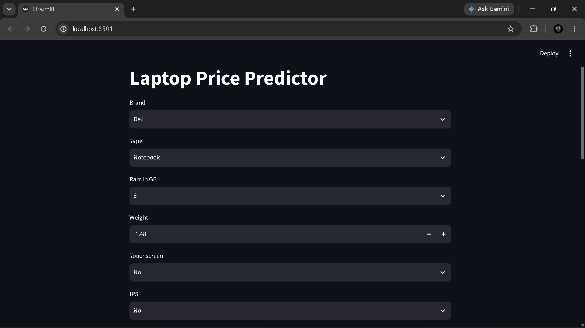
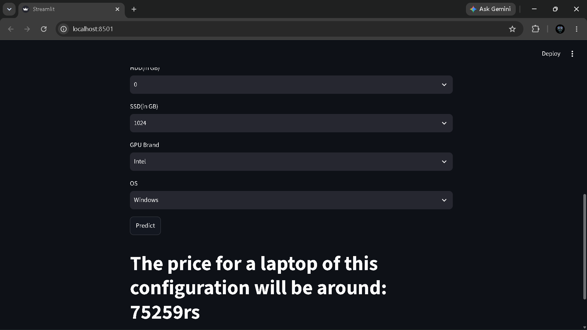

# 💻 Laptop-Price-Predictor

An ML-powered web application that estimates laptop market prices from hardware specifications — built with scikit-learn, XGBoost, and Streamlit.

---

## 📖 Overview

Laptop prices vary significantly even for seemingly identical specifications. This project uses machine learning models trained on ~1,300 real laptop configurations to predict market prices based on brand, CPU, GPU, RAM, storage, display quality, and operating system.

Enter the specifications → get an instant price estimate in **₹ (INR)**.

---

## 🖼️ Screenshots

| Specification Inputs | Price Estimation |
| :---: | :---: |
|  |  |

---

## ✨ Features

* **Brand & System Selection:** Company, Laptop Type, CPU brand, GPU brand, and OS dropdowns.
* **Display & Build Config:** RAM, Weight, Screen Size (inches), PPI resolution, Touchscreen, and IPS options.
* **Hybrid Storage:** Flexible HDD and SSD storage combinations.
* **Tuned Inference:** Fast prediction pipeline using an optimized ensemble regressor.
* **Log-Transformed Target:** Mitigates right-skewed pricing distributions for balanced error rates across budget and flagship tiers.

---

## 🛠️ Tech Stack

| Domain | Technologies |
| :--- | :--- |
| **Language** | Python 3.9+ |
| **ML Models** | XGBoost, Random Forest, Gradient Boosting, AdaBoost, VotingRegressor |
| **Preprocessing** | scikit-learn (`OneHotEncoder`, `ColumnTransformer`, `Pipeline`) |
| **Data Handling** | pandas, NumPy |
| **Web Interface** | Streamlit |
| **Serialization** | pickle |

---

## 🧠 Model & Approach

### Preprocessing
* **Categorical Encoding:** `OneHotEncoder` applied to `Company`, `TypeName`, `Cpu brand`, `Gpu brand`, and `os`.
* **Numerical Features:** Passed through directly (`Ram`, `Weight`, `Touchscreen`, `Ips`, `ppi`, `HDD`, `SSD`).
* **Target Transformation:** $\log(y)$ applied during training via `np.log1p` to stabilize variance, then exponentiated via `np.expm1` at inference.
* **Export:** Packaged inside a unified `Pipeline` object containing both the preprocessor and estimator.

### Benchmark Results

| Model | $R^2$ Score | MAE |
| :--- | :---: | :---: |
| **VotingRegressor (RF + GBDT + XGB)** | **0.9037** | **1.1560** |
| XGBoost Regressor | 0.9020 | 1.1538 |
| Gradient Boosting Regressor | 0.8948 | 1.1640 |
| Random Forest Regressor | 0.8880 | 1.1690 |
| Extra Trees Regressor | 0.8848 | 1.1740 |
| AdaBoost Regressor | 0.8488 | 1.2168 |
| Ridge Regression | 0.8120 | 1.2330 |
| Linear Regression | 0.8070 | 1.2330 |

> **Final Estimator:** Tuned `RandomForestRegressor(n_estimators=300, max_samples=0.63, max_features=0.64, max_depth=13, random_state=42)` alongside the ensemble configurations.

---

## 🚀 Getting Started

### Prerequisites
* Python 3.9 or higher
* Git

### Installation

1. **Clone the repository:**
   ```bash
   git clone [https://github.com/](https://github.com/)[Dhanush-K249]/Laptop-Price-Predictor.git
   cd Laptop-Price-Predictor
   ```
2. **Install Dependencies:**
   ```bash
   pip install -r streamlit_app/requirements.txt
   ```
3. **Run the streamlip app**
   ```bash
   python -m streamlit run streamlit_app/app.py
   ```
The local development server will start at http://localhost:8501.
